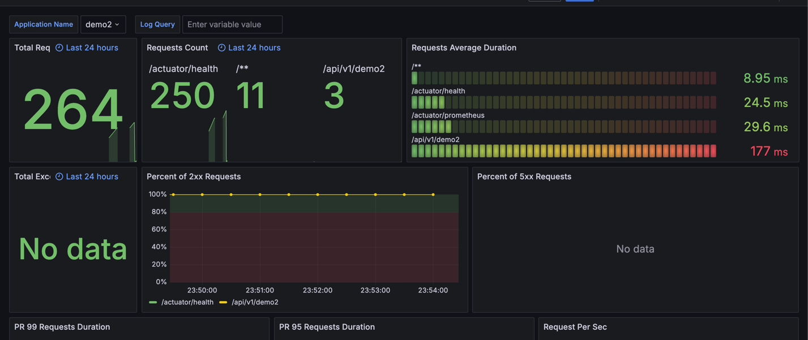

# calico

https://docs.tigera.io/calico/latest/getting-started/kubernetes/quickstart

# loadbalancer MetalLB

https://cla9.tistory.com/94

# ingress-controller-nginx

https://kubernetes.github.io/ingress-nginx/deploy/

helm repo add ingress-nginx https://kubernetes.github.io/ingress-nginx

helm repo update

helm install nginx-ingress ingress-nginx/ingress-nginx

확인

kubectl get pods -n default -l app.kubernetes.io/name=ingress-nginx

minikube tunnel 미니 쿠버일때

kubectl get pods -n default -l app.kubernetes.io/name=ingress-nginx

kubectl get svc -n default nginx-ingress-ingress-nginx-controller

```
...
spec:
clusterIP: 10.107.23.205
clusterIPs:

- 10.107.23.205
  externalIPs:
- 내부
  ...
```

kubectl get ing -A

kubectl describe ing my-ingress -n ingress-nginx

kubectl describe ingress my-ingress -n my-namespace

kubectl logs -l app.kubernetes.io/name=ingress-nginx -n default

mysql1
CREATE TABLE mydb1.Board (
id BINARY(16) NOT NULL,
title VARCHAR(255) NOT NULL,
content TEXT NOT NULL,
PRIMARY KEY (id)
);

mysql2

CREATE TABLE mydb2.Comment ( id BINARY(16) NOT NULL, content TEXT NOT NULL, board_id BINARY(16) NOT NULL, PRIMARY KEY (id));

https://kubernetes.github.io/ingress-nginx/user-guide/ingress-path-matching/

pathValue 사용

---

# kube-metric

https://github.com/kubernetes-sigs/metrics-server

```
kubectl apply -f https://github.com/kubernetes-sigs/metrics-server/releases/latest/download/components.yaml
```

I0717 12:19:32.132722 1 server.go:187] "Failed probe" probe="metric-storage-ready" err="no metrics to serve"
E0717 12:19:39.159422 1 scraper.go:140] "Failed to scrape node" err="Get \"https://192.168.49.2:10250/metrics/resource\": x509: cannot validate certificate for 192.168.49.2 because it doesn't contain any IP SANs" node="minikube"

```
kubectl patch deployment metrics-server -n kube-system --type='json' -p='[{"op": "add", "path": "/spec/template/spec/containers/0/args/-", "value": "--kubelet-insecure-tls"}]'
```

---

# helm

https://helm.sh/docs/intro/install/

helm create back1

cd back1

rm templates

템플릿을 사용안하고 안에 여러가지 디펜던시 만들어 사용할 거라 삭제

change Chart.yaml

디펜던시 설정 해줘야함

cd charts

helm create back1

helm create db-1

안에 만들고

Values.yaml 설정

helm install back1 back1 -n back

helm install back2 back2 -n back

뭔가 바뀔 때

helm upgrade back2 back2 -n back

여러가지 설정은 안에 있음

---

# argocd

https://argo-cd.readthedocs.io/en/stable/getting_started/

intstall

kubectl create namespace argocd

kubectl apply -n argocd -f https://raw.githubusercontent.com/argoproj/argo-cd/stable/manifests/install.yaml

kubectl edit svc argocd-server -n argocd

```
ports:
- name: http
  nodePort: 30001
  port: 80
  protocol: TCP
  targetPort: 8080
- name: https
  nodePort: 31397
  port: 443
  protocol: TCP
  targetPort: 8080
selector:
  app.kubernetes.io/name: argocd-server
  sessionAffinity: None
  type: NodePort
```

https://localhost:30001/login?return_url=https%3A%2F%2Flocalhost%3A30001%2Fapplications

kubectl exec -it argocd-server-697df9f478-v4chh /bin/bash -n argocd

argocd admin initial-password -n argocd

password 출력

id admin
password password

---

# monitoring

---

그라파나 + 프로메테우스

설치
```
kubectl create ns mon
helm repo add prometheus-community https://prometheus-community.github.io/helm-charts
helm repo update
helm install pgs prometheus-community/kube-prometheus-stack -n mon
```

spring 설정은 프로젝트 참고
- build.gradle 추가
- 설정 추가

pgs-kube-prometheus-stack-prometheus

pgs-grafana

nodePort로 열어버리기

https://grafana.com/grafana/dashboards/?search=deploy


### spring 연동

helm back 쪽 서비스에 설정 추가
```
---
apiVersion: monitoring.coreos.com/v1
kind: ServiceMonitor
metadata:
  name: {{ include "back2.fullname" . }}
  labels:
    {{- include "back2.labels" . | nindent 4 }}
    release: pgs
spec:
  selector:
    matchLabels:
      app: {{- include "back2.selectorLabels" . | nindent 6 }}
  endpoints:
    - port: http
      path: "/actuator/prometheus"
```
<b>label 에 release: prometheus , prometheus object의 key:value와 꼭 맞추어 줍니다.</b>

prometheus 가서 targets 확인


kubectl get secret --namespace mon pgs-grafana  -o jsonpath="{.data.admin-password}" | base64 --decode ; echo

https://grafana.com/grafana/dashboards/19004-spring-boot-statistics/

## loki


```
helm repo add grafana https://grafana.github.io/helm-charts
helm repo update
helm upgrade --install pgs grafana/loki-stack \
    --set grafana.enabled=true,prometheus.enabled=true \
    -n mon
```

grafana nodePort로 열어버리기


kubectl get secret --namespace mon pgs-grafana  -o jsonpath="{.data.admin-password}" | base64 --decode ; echo


---
node-exporter 에러 발생시

kubectl patch ds pgs-prometheus-node-exporter -n mon --type "json" -p "[{'op': 'remove', 'path' : '/spec/template/spec/containers/0/volumeMounts/2/mountPropagation'}]"

---


spring 설정은 프로젝트 참고
- build.gradle 추가 
- 설정 추가

http://loki.mon.svc.cluster.local:3100

이거로 datasource 설정

실패해도 괜찮음<br>
17175 이거 연결하고 쏜다



--- 
## mysql 연결 
---

datasource 설정

mysql

back1-db-1.back.svc.cluster.local:3306

이렇게 사용

root로 하고 그냥 연결


